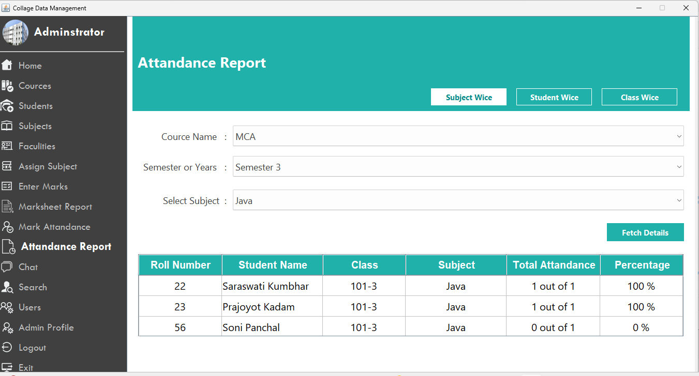

# College Information System

A desktop-based College Information System developed using Java Swing and MySQL.

## 🔧 Tech Stack
- Java
- Java Swing
- MySQL
- JDBC
- Eclipse IDE

## 📌 Features
### Common Features
- Student Management
- Faculty Management
- Course & Subject Management
- Attendance Management
- Marks & Result Management

### Advanced Features 🔥
- Roll Number Generator
- Student & Faculty Login
- Real-time Chatting
- Group Chat
- Notifications
- Message Delivery & Seen Status
- Login History
- Marksheet Download

## 🗄 Database
- MySQL
- SQL file: `collegedata.sql`

## ▶ How to Run Project
1. Clone the repository
2. Open project in Eclipse
3. Create MySQL database using `collegedata.sql`
4. Update database credentials in code
5. Run the Login/Main class

## 📸 Screenshots

### Login Screen

### Home Page

### College Details

### Courses List

### Subjects

### Students Management

### Student Details

### Faculties

### Attendance Marking

### Attendance Report

### Declare Result

### Marksheet

### Personal Chat

### Group Chat

## 👩‍💻 Author
**Saraswati Kumbhar**  
M.Sc Computer Science – COCSIT, Latur  
📧 Email: saraswatik1432@gmail.com

## 📄 License
Apache License 2.0
