# College Information System In Java

## Hi there !

Here I have designed and developed College Information system. The Technology I have used is Java Swing, and database i have used is MySql.
This design is purely coded myself no copied content.

Thanks !

## Features

 * Common Features 
      * Cources Management
      * Subjects Management
      * Students Management
      * Faculties Management
      * Students Attandance Management
      * Student Marks Management
 * Advance Features 🔥
      * Rollnumber Generator
      * Chatting
          * Message delivered
          * Unseen messages
          * Notification
          * Group chatting
      * Photo view of Students and Faculties
      * Student or Faculty login history
      * Download Marksheet
      * Notification
      * Declare result

## Screenshots

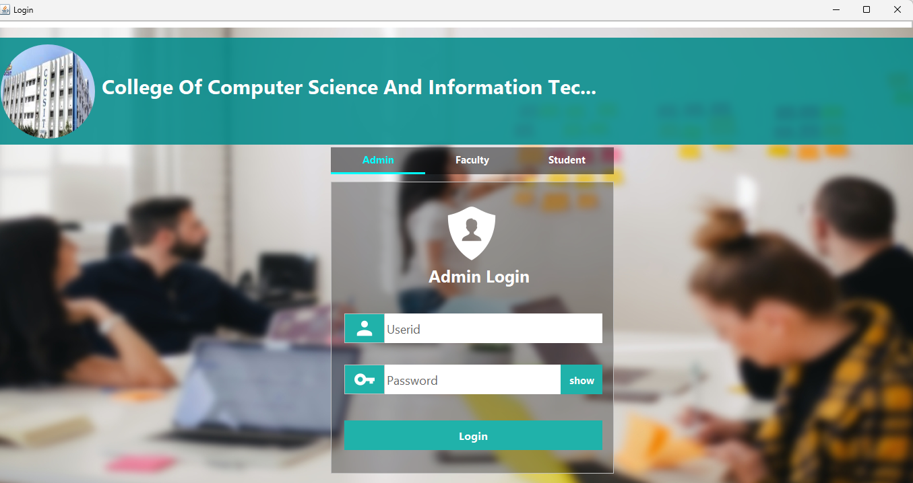
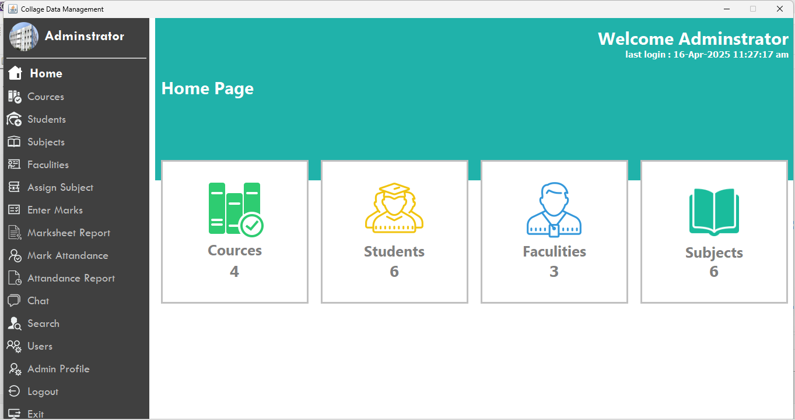
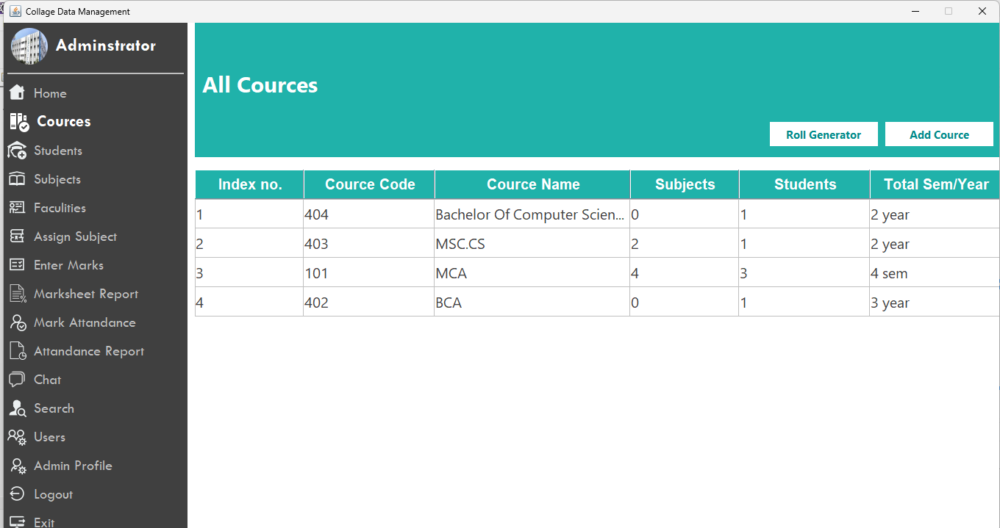
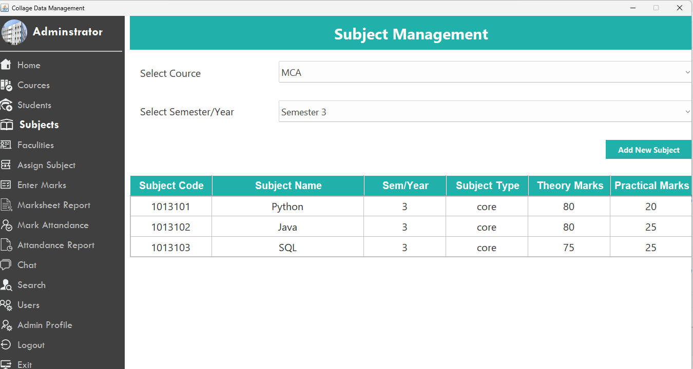
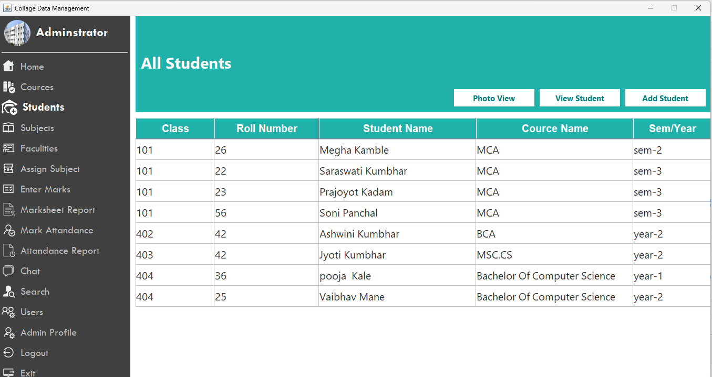
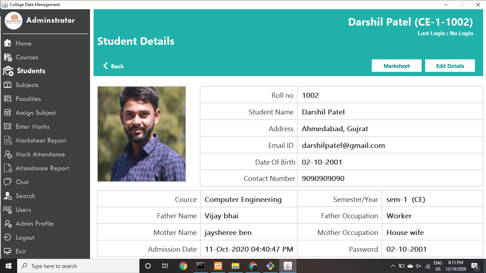
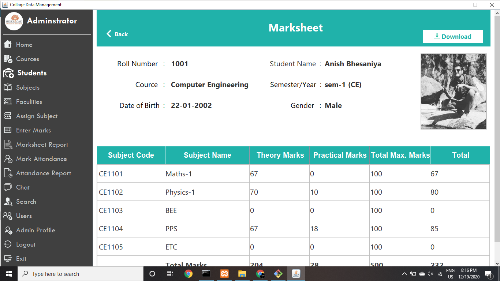
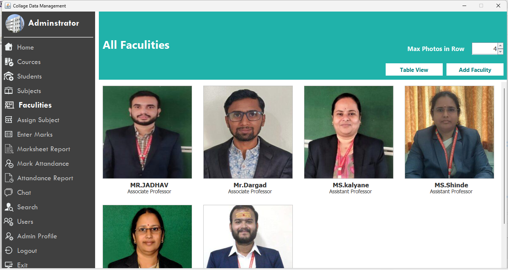
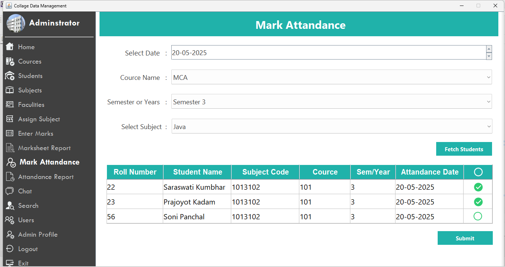
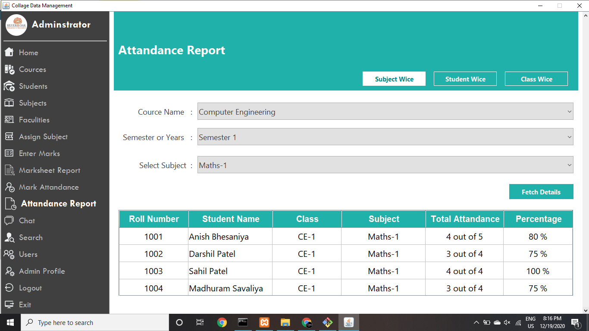
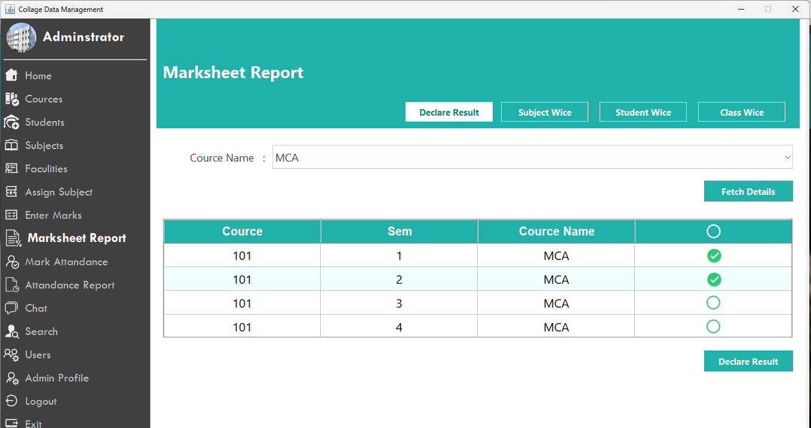
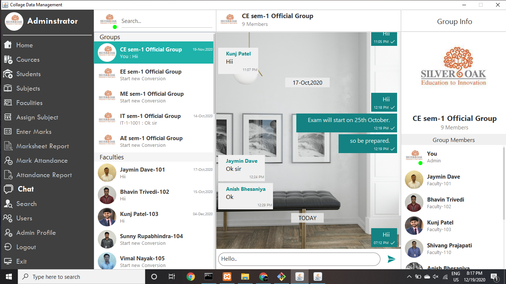
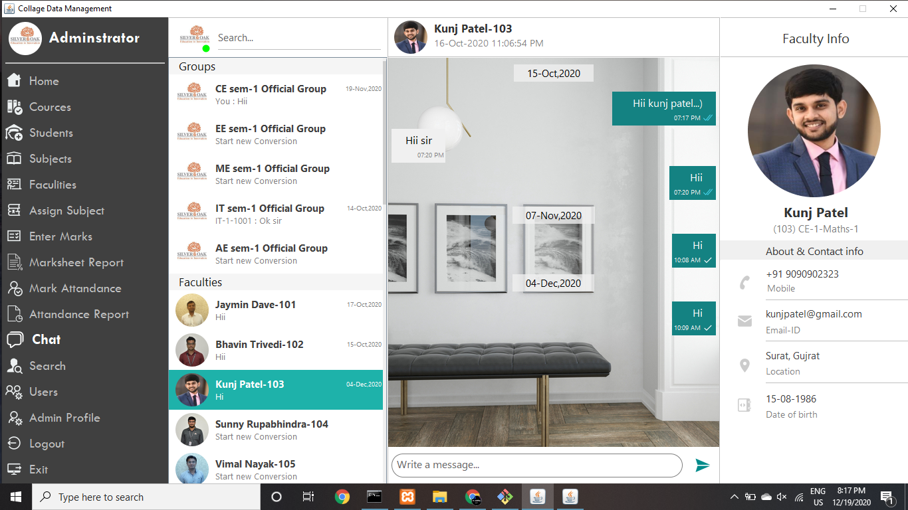
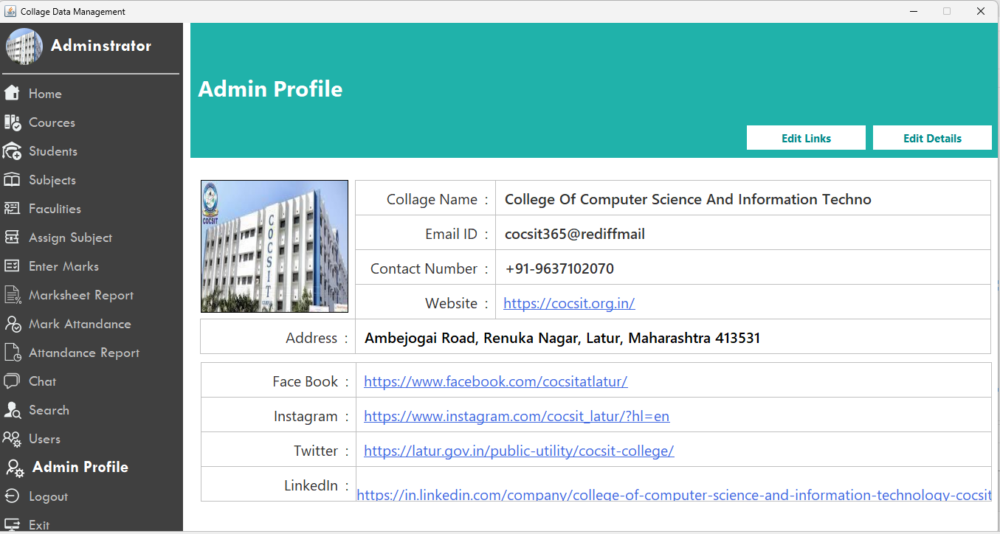

## About

My name is [Saraswati Kumbhar]( https://github.com/saraswati89). I'm studying Master Of Computer Science (2nd Year) in COCSIT(Latur). Contact me for any improvement in this project.

Email : saraswatik1432@gmail.com
